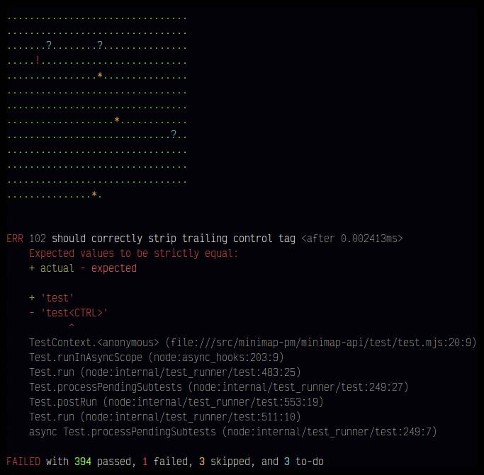

# tap-dot-neo

A spiritual successor to [`tap-dot`](https://github.com/scottcorgan/tap-dot),
which has unfortunately begun to show its age.

## Usage

```
npm i tap-dot-neo
```

```
./some-tap-tests | tap-dot-neo
```

# License

Created by Josh Junon.

Released under [CC0](https://creativecommons.org/share-your-work/public-domain/cc0/). Go nuts.
